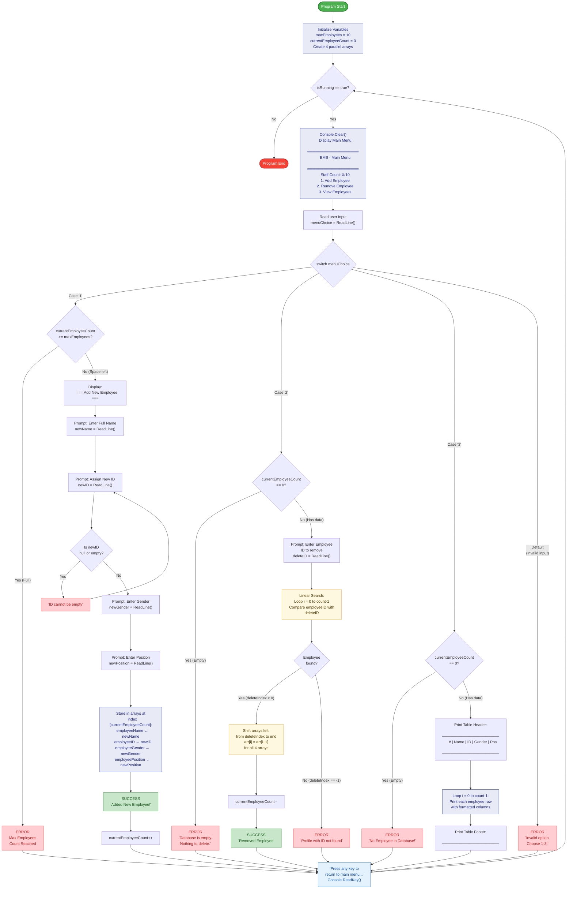

```mermaid
flowchart TD
    A([Program Start]) --> B["Initialize Variables
    maxEmployees = 10
    currentEmployeeCount = 0
    Create 4 parallel arrays"]

    B --> C{"isRunning == true?"}
    C -- "No" --> Z([Program End])

    C -- Yes --> D["Console.Clear()
    Display Main Menu
    ═══════════════════
    EMS - Main Menu
    ═══════════════════
    Staff Count: X/10
    1. Add Employee
    2. Remove Employee
    3. View Employees"]

    D --> E["Read user input
    menuChoice = ReadLine()"]

    E --> F{switch menuChoice}

    %% ── CASE 1: ADD ──
    F -- "Case '1'" --> G{"currentEmployeeCount
    >= maxEmployees?"}

    G -- "Yes (Full)" --> H["ERROR
    Max Employees
    Count Reached"]
    H --> PAUSE

    G -- "No (Space left)" --> I["Display:
    === Add New Employee ==="]
    I --> J["Prompt: Enter Full Name
    newName = ReadLine()"]
    J --> K["Prompt: Assign New ID
    newID = ReadLine()"]
    K --> L{"Is newID
    null or empty?"}
    L -- Yes --> M["'ID cannot be empty'"]
    M --> K
    L -- No --> N["Prompt: Enter Gender
    newGender = ReadLine()"]
    N --> O["Prompt: Enter Position
    newPosition = ReadLine()"]
    O --> P["Store in arrays at
    index [currentEmployeeCount]:
    employeeName ← newName
    employeeID ← newID
    employeeGender ← newGender
    employeePosition ← newPosition"]
    P --> Q["SUCCESS
    'Added New Employee!'"]
    Q --> R["currentEmployeeCount++"]
    R --> PAUSE

    %% ── CASE 2: REMOVE ──
    F -- "Case '2'" --> S{"currentEmployeeCount
    == 0?"}

    S -- "Yes (Empty)" --> T["ERROR
    'Database is empty.
    Nothing to delete.'"]
    T --> PAUSE

    S -- "No (Has data)" --> U["Prompt: Enter Employee
    ID to remove
    deleteID = ReadLine()"]
    U --> V["Linear Search:
    Loop i = 0 to count-1
    Compare employeeID with
    deleteID"]
    V --> W{"Employee
    found?"}
    W -- "Yes (deleteIndex ≥ 0)" --> X["Shift arrays left:
    from deleteIndex to end
    arr[i] = arr[i+1]
    for all 4 arrays"]
    X --> Y["currentEmployeeCount--"]
    Y --> Y2["SUCCESS
    'Removed Employee'"]
    Y2 --> PAUSE

    W -- "No (deleteIndex == -1)" --> AA["ERROR
    'Profile with ID not found'"]
    AA --> PAUSE

    %% ── CASE 3: VIEW ──
    F -- "Case '3'" --> BB{"currentEmployeeCount
    == 0?"}

    BB -- "Yes (Empty)" --> CC["ERROR
    'No Employee in Database!'"]
    CC --> PAUSE

    BB -- "No (Has data)" --> DD["Print Table Header:
    ─────────────────────
    # | Name | ID | Gender | Pos
    ─────────────────────"]
    DD --> EE["Loop i = 0 to count-1:
    Print each employee row
    with formatted columns"]
    EE --> FF["Print Table Footer:
    ─────────────────────"]
    FF --> PAUSE

    %% ── DEFAULT ──
    F -- "Default
    (invalid input)" --> GG["ERROR
    'Invalid option.
    Choose 1-3.'"]
    GG --> PAUSE

    %% ── PAUSE & LOOP BACK ──
    PAUSE["'Press any key to
    return to main menu...'
    Console.ReadKey()"]
    PAUSE --> C

    %% ── STYLING ──
    style A fill:#4CAF50,stroke:#2E7D32,color:#fff,stroke-width:2px
    style Z fill:#f44336,stroke:#c62828,color:#fff,stroke-width:2px
    style H fill:#ffcdd2,stroke:#e53935,color:#b71c1c
    style T fill:#ffcdd2,stroke:#e53935,color:#b71c1c
    style CC fill:#ffcdd2,stroke:#e53935,color:#b71c1c
    style AA fill:#ffcdd2,stroke:#e53935,color:#b71c1c
    style GG fill:#ffcdd2,stroke:#e53935,color:#b71c1c
    style M fill:#ffcdd2,stroke:#e53935,color:#b71c1c
    style Q fill:#c8e6c9,stroke:#43A047,color:#1b5e20
    style Y2 fill:#c8e6c9,stroke:#43A047,color:#1b5e20
    style PAUSE fill:#e3f2fd,stroke:#1565C0,color:#0D47A1
    style B fill:#e8eaf6,stroke:#3949AB,color:#1A237E
    style D fill:#e8eaf6,stroke:#3949AB,color:#1A237E
    style P fill:#e8eaf6,stroke:#3949AB,color:#1A237E
    style X fill:#fff8e1,stroke:#F9A825,color:#4a3800
    style V fill:#fff8e1,stroke:#F9A825,color:#4a3800
    style EE fill:#e8eaf6,stroke:#3949AB,color:#1A237E
```
